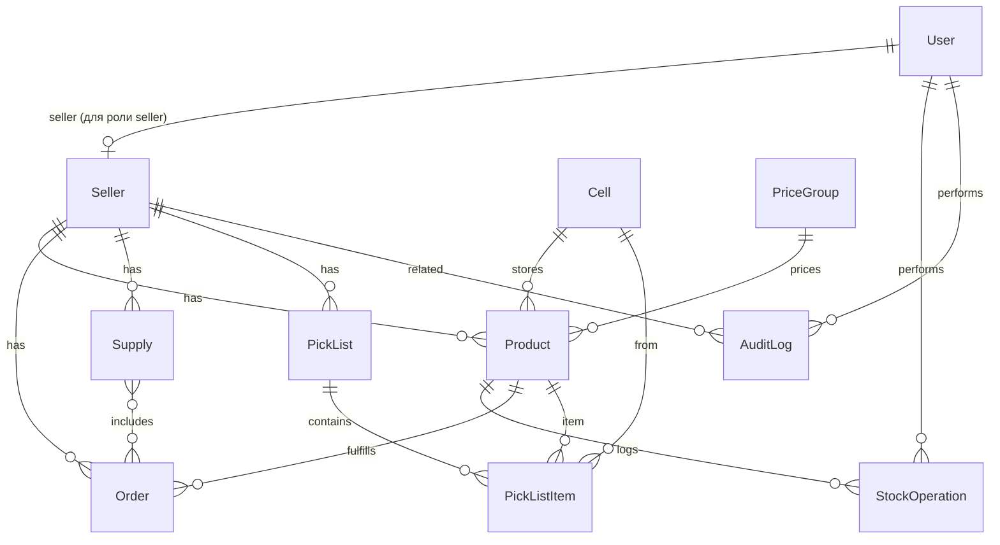

# Схема базы данных

**Актуально на 27.08.2026.** Соответствует моделям Django в `backend/apps/`.

## ER-диаграмма (основные сущности)

## Таблицы

### accounts_user
Кастомная модель пользователя (расширяет AbstractUser).

| Поле | Тип | Описание |
|------|-----|----------|
| role | enum | admin / manager / seller |
| seller_id | FK → sellers_seller | Привязка для роли seller |

### sellers_seller
| Поле | Тип | Описание |
|------|-----|----------|
| company_name | varchar | ИП / название |
| wb_api_token_encrypted | text | Зашифрованный токен WB |
| is_active | bool | Активен |

### warehouse_cell
| Поле | Тип | Описание |
|------|-----|----------|
| number | varchar, unique | Номер ячейки |
| is_occupied | bool | Занята |

### warehouse_pricegroup
| Поле | Тип | Описание |
|------|-----|----------|
| name | varchar | Название группы |
| processing_price | decimal | Стоимость обработки за ед. |

### warehouse_product
| Поле | Тип | Описание |
|------|-----|----------|
| seller_id | FK | Селлер |
| barcode | varchar | Баркод (unique per seller) |
| cell_id | FK | Ячейка (1 баркод = 1 ячейка) |
| price_group_id | FK | Ценовая группа |
| individual_price | decimal, nullable | Индивидуальная цена (приоритет) |
| requires_marking | bool | Требует Честный знак |
| quantity | int | Остаток |

### warehouse_stockoperation
Журнал приёмки, списаний, возвратов.

### orders_order
| Поле | Тип | Описание |
|------|-----|----------|
| wb_order_id | bigint, unique | ID заказа WB |
| barcode | varchar | Баркод заказа |
| status | enum | new → shipped |
| marking_code | varchar | Код DataMatrix |
| marking_bound | bool | ЧЗ привязан |

### orders_picklist / orders_picklistitem
Внутренний лист подбора с группировкой по ячейкам.

### orders_supply
Поставка WB. Списание остатков после подтверждения.

### warehouse_xlintakesession / warehouse_xlintakeline
Приёмка в XL: поштучный скан до подключения API WB. Строка — уникальный баркод, `sort_order` (1, 2, 3…), `quantity`.

### integrations_auditlog
Лог всех действий и ошибок API.

## Индексы (критичные для нагрузки)

- `orders_order(wb_order_id)` — уникальный
- `orders_order(seller_id, status)` — фильтрация заказов
- `warehouse_product(seller_id, barcode)` — сканирование при приёмке/сборке
- `integrations_auditlog(action_type, created_at)` — отчёты

## Правила из ТЗ

1. Один баркод = одна ячейка (per seller)
2. Менеджер не видит `processing_price`, `individual_price`, финансовые отчёты
3. Токены WB хранятся зашифрованными (`wb_api_token_encrypted`)
4. Списание остатков только после подтверждения поставки WB
